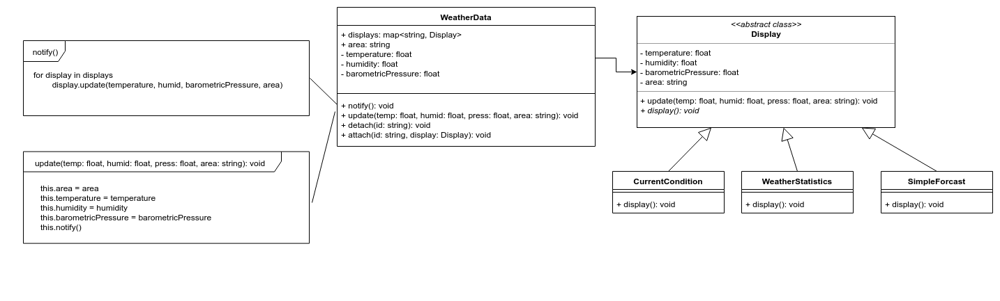

# WeatherMonitoringStationSystem

## Initial Design

## Refactor Design

## SPEC
Weather Monitoring Station System
* The system will be based on WeatherData object, which tracks
current weather conditions (temperature, humidity, and barometric
pressure) in a specific area (e.g. U.S. or Asia).
* The system initially provides three display elements: current
conditions, weather statistics and a simple forecast, all updated in
real time as the WeatherData object acquires the most recent
measurements.
* The system should supply an API so that other developers can write
their own weather displays and plug them right in.
